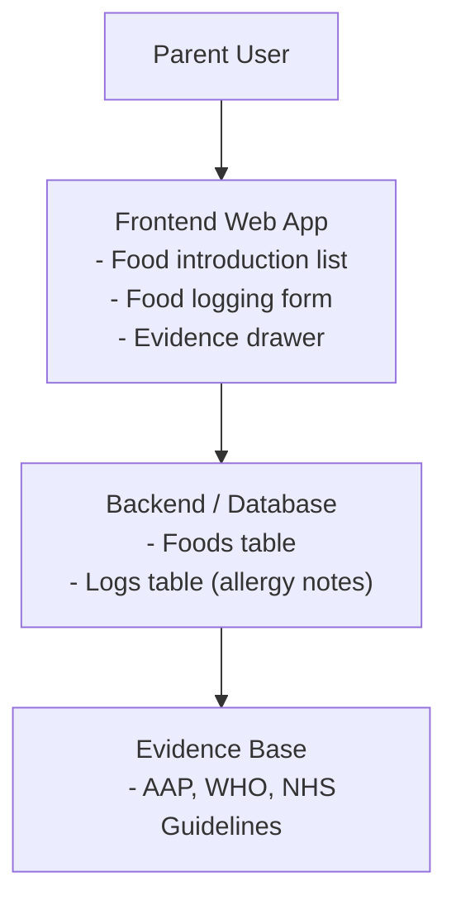

# Baby-Led Weaning Tracker  
## Part A: Project Pitch  

---

## Problem  
Baby-led weaning (BLW) is a contemporary approach to complementary feeding that encourages infants to self-feed developmentally appropriate pieces of solid food, rather than being spoon-fed purées by a caregiver. Advocates of BLW point to benefits such as improved oral-motor development, earlier development of self-regulation in eating, increased exposure to family meals, and fostering a more positive, interactive mealtime environment. However, despite its popularity among modern parents, especially in online communities, BLW comes with significant challenges that create uncertainty and stress.  

Caregivers frequently ask questions like: *Which foods are safe to introduce at six months? How should certain foods be prepared to reduce choking hazards? How do I know if a baby is ready for specific textures?*  

Compounding this uncertainty, there are also important concerns around allergy tracking and monitoring symptoms, since the American Academy of Pediatrics (AAP) and other authorities now recommend introducing common allergens (such as peanuts or eggs) relatively early to reduce risk of allergy development. Without a systematic way to track exposures, parents may forget which foods were tried, how the baby reacted, and whether allergen introductions are progressing according to best practices.  

Information on BLW is widely available, but it is scattered. Parents may consult pediatric associations, the World Health Organization (WHO), and national health services for guidelines, but many also rely on less formal sources such as parenting blogs, TikTok “experts,” and Facebook groups. These informal sources are often inconsistent, anecdotal, or outright contradictory. Parents are left without a centralized, trustworthy, and interactive resource that consolidates credible guidelines while also allowing them to personalize the experience by recording their child’s food introduction journey.  

The **BLW Tracker** addresses this need directly. It combines:  
1. Age-based food introduction guidance with step-by-step preparation notes and safety warnings.  
2. A logging tool that allows caregivers to keep track of which foods have been introduced, when they were given, and whether any reactions occurred.  
3. An evidence drawer that links to authoritative, up-to-date sources so parents can feel confident that the guidance they are following is grounded in professional health recommendations.  

By combining guidance, interactivity, and transparency, the BLW Tracker becomes a supportive partner to caregivers navigating the first year of solids.  

---

## Stakeholders  
- **Parents/Guardians:** Require clear, structured, and easy-to-follow guidance on safe feeding practices. They also need a lightweight logging system to document their baby’s food exposures, note possible allergies, and feel more in control of the process.  
- **Childcare providers:** In settings where infants are cared for by others (daycares, babysitters, relatives), this tool provides caregivers with a quick reference guide for safe preparation.  
- **Healthcare professionals (pediatricians/dietitians):** May recommend the tool to families as a resource aligned with official guidelines.  
- **Course Participants:** At an academic level, this project serves as a case study in applying iterative design principles to create a socially relevant digital artifact that solves a practical, real-world problem.  

---

## Scope  
### In-scope for Minimal Viable Artifact (MVA):  
- Food introduction module: age-based lists beginning at 6 months (when it is recommended to start introducing solids) with specific preparation guidelines.  
- Food logging tool: add/edit foods introduced, record date, and note reactions.  
- Allergy notes: simple text area to note/flag sensitivities.  
- Evidence drawer: transparent citations to AAP, WHO, and NHS guidelines.  

### Out of scope:  
- Personalized meal planning.  
- Personalized nutrition tracking.  
- Community/social recipe-sharing features.  
- Gamification (badges, streaks, achievements).  

---

## Success Metrics  
- **Adoption:** At least 70% of first-time users log one food.  
- **Safety Clarity:** 80% of survey respondents report increased confidence in preparation methods.  
- **Transparency:** 30% of sessions include opening the evidence drawer.  
- **Retention:** At least half of users return within one week to log additional foods.  

---

## Minimal Viable Artifact (MVA)  
The BLW Tracker’s MVA consists of 3 core features:  
1. Food introduction guide – age-appropriate with preparation instructions.  
2. Food logging tool – CRUD (create, read, update, delete) functionality to track the introduced foods and notes.  
3. Evidence drawer – citations to authoritative resources to support given recommendations.  

---

## System Sketch  

*Figure 1. System sketch showing user interaction with the BLW Tracker front-end, back-end, database, and evidence base module.*  

---

## Evidence Base  
1. American Academy of Pediatrics. (2023). *Starting Solid Foods*. HealthyChildren.org. https://www.healthychildren.org  
2. World Health Organization. (2023). *Complementary Feeding Guidelines*. https://www.who.int/health-topics/infant-feeding  
3. National Health Service (UK). (2024). *Baby-led Weaning Advice*. NHS. https://www.nhs.uk/startingsolids  
4. Centers for Disease Control and Prevention. (2023). *Infant & Toddler Nutrition*. CDC. https://www.cdc.gov/nutrition  

---

## Risk Register  

| Risk | Impact | Likelihood | Mitigation |  
|------|--------|------------|-------------|  
| Unsafe or incorrect preparation advice | High | Medium | Use only authoritative sources (AAP, WHO, NHS); keep steps conservative; display disclaimers. |  
| Privacy concerns when logging child’s data | Medium | Medium | Collect minimal info; allow local-only storage; avoid names/photos. |  
| Scope creep beyond MVA | Medium | High | Limit to 3 core features; defer extras to roadmap; apply iteration gates after reviews; stay disciplined. |  

